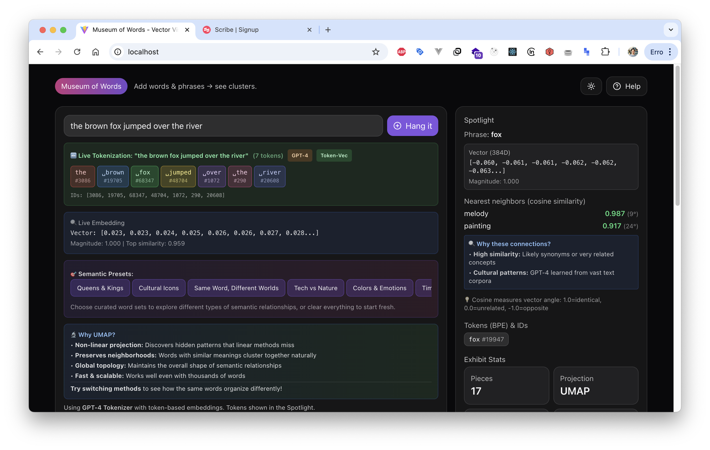

# DL Vector Museum of Words 🏛️

> An interactive educational tool for exploring the fascinating world of tokenization, semantic relationships, and vector embeddings

[](https://reactjs.org/)
[](https://www.typescriptlang.org/)
[](https://vitejs.dev/)
[](https://threejs.org/)
[](https://opensource.org/licenses/MIT)
[](http://makeapullrequest.com)

## 💡 Motivation

As I delved deeper into natural language processing and machine learning, I found myself constantly wondering: *"How do language models actually understand text?"* The abstract concepts of tokenization, embeddings, and semantic similarity felt mysterious and hard to grasp.

This project was born from my desire to **see** and **interact with** these concepts. I wanted to understand:
- How does GPT-4 break down my sentences into tokens?
- What does "semantic similarity" really mean in practice?
- How do high-dimensional vectors get projected into 2D/3D space?
- Why do some seemingly unrelated words appear close together?

By building this interactive visualizer, I transformed abstract mathematical concepts into something tangible and explorable. What started as a learning exercise became a tool that I hope will help others on their own journey of understanding how AI processes language.

## 🎯 What is DL Vector Museum of Words?

DL Vector Museum of Words is an interactive web application that makes the invisible mechanics of language processing visible. Think of it as a "developer tools" for understanding how AI models tokenize and represent text.

### Key Capabilities

🔤 **See Tokenization in Action** - Watch as GPT-4's tokenizer breaks your text into subword pieces in real-time

📊 **Visualize Semantic Relationships** - Explore how words cluster based on meaning in 2D and 3D space

🔬 **Understand Dimensionality Reduction** - Compare UMAP vs PCA and see how they reveal different patterns

🎮 **Interactive Learning** - Click, drag, and explore to build intuition about vector spaces

🧠 **Educational Content** - Built-in explanations help you understand what you're seeing

## 📸 Screenshots

### Main Interface

*The main dashboard showing the interactive vector visualization interface with word clustering and navigation controls*

### Tokenization in Action  

*Real-time GPT-4 tokenization - watch as your text gets broken down into subword tokens exactly as language models see it*

### 3D Vector Space Exploration

*Immersive 3D exploration of semantic relationships - navigate through vector space and discover how words cluster by meaning*

## 🌐 Live Demo

**🎯 Try it now:** [https://dl-vector-museum-of-words.pages.dev](https://dl-vector-museum-of-words.pages.dev)

Experience the DL Vector Museum of Words live! No installation required - just open the link and start exploring how language models understand and process text. The application is deployed on Cloudflare Pages for optimal performance worldwide.

**Alternative URLs:**
- **Production**: [https://master.dl-vector-museum-of-words.pages.dev](https://master.dl-vector-museum-of-words.pages.dev)
- **Latest Build**: [https://f9845523.dl-vector-museum-of-words.pages.dev](https://f9845523.dl-vector-museum-of-words.pages.dev)

## ✨ Features

### 🎨 **Interactive Visualizations**
- **Gallery Wall**: 2D scatter plot with animated word placards
- **Matrix Room**: Heatmap showing pairwise semantic similarities
- **3D Space**: Immersive 3D visualization of semantic relationships
- **Real-time Updates**: Watch clusters form as you add new words

### 🔤 **Advanced Tokenization**
- **GPT-4 Tokenizer**: Uses the same tokenizer as GPT-4 and GPT-3.5
- **100,257 Token Vocabulary**: Complete cl100k_base encoding
- **Token Classification**: Common, Frequent, Normal, Rare, and Special tokens
- **Live Preview**: See tokenization happen in real-time as you type
- **Educational Insights**: Learn how BPE (Byte Pair Encoding) works

### 🔬 **Dimensionality Reduction**
- **UMAP**: Non-linear manifold learning for discovering clusters
- **PCA**: Linear projection showing main variance directions
- **Adjustable Parameters**: Fine-tune clustering and layout
- **Educational Explanations**: Understand when and why to use each method

### 📊 **Comprehensive Analytics**
- **Semantic Similarity**: Cosine similarity with color-coded relationships
- **Token Statistics**: Character counts, compression ratios, vocabulary usage
- **Neighbor Analysis**: Discover unexpected word relationships
- **Cultural Patterns**: Explore hidden connections in language

## 🚀 Getting Started

### Prerequisites
- Node.js 16+ and npm
- A modern browser (Chrome, Firefox, Safari, Edge)
- Curiosity about how language models work! 🧠

### Quick Setup

```bash
# Clone the repository
git clone https://github.com/your-username/museum-of-words.git
cd museum-of-words

# Install dependencies
npm install

# Start the development server
npm run dev
```

Open [http://localhost:3000](http://localhost:3000) and start exploring!

### Docker Setup (Optional)

```bash
# Build the Docker image
docker build -t museum-of-words .

# Run the container
docker run -p 3000:3000 museum-of-words
```

### Production Build

```bash
# Build for production
npm run build

# Preview production build
npm run preview

# Type checking
npm run typecheck

# Linting
npm run lint
```

## 📖 How to Use

### 🏁 First Steps
1. **Start with examples**: Click one of the semantic presets like "Queens & Kings" or "Tech vs Nature"
2. **Add your own words**: Type anything in the input field and click "Hang it"
3. **Explore relationships**: Click on any word to see its semantic neighbors
4. **Try different views**: Switch between the four main tabs to see different perspectives

### 🎨 The Four Views Explained

#### 🖼️ Gallery Wall
Your main workspace - a 2D projection of semantic space where:
- **Word placards** represent your added words/phrases
- **Colored lines** connect semantically similar items
- **Clusters** show groups of related concepts
- **Click any word** to highlight its nearest neighbors

#### 🔥 Matrix Room
A heatmap showing exact similarity scores:
- **Red = highly similar** (synonyms, related concepts)
- **Blue = dissimilar** (unrelated words)
- **Hover cells** to see precise cosine similarity values
- Perfect for understanding numerical relationships

#### 🌌 3D Space
Navigate semantic space in three dimensions:
- **Mouse controls**: Click and drag to rotate, scroll to zoom
- **Word spheres** float in 3D semantic space
- **Depth perception** reveals relationships not visible in 2D
- Great for finding unexpected connections

#### 🔤 Tokenizer Lab
See how GPT-4 breaks down your text:
- **Real-time tokenization** as you type
- **Color-coded tokens** with frequency classification
- **Token statistics** (vocabulary usage, compression ratios)
- **Educational insights** about Byte Pair Encoding (BPE)

### 🎯 Pro Tips for Exploration

#### 🔍 **Discovery Techniques**
```
Try these word combinations to see interesting patterns:

• Synonyms: "happy, joyful, cheerful, glad"
• Categories: "dog, cat, bird, fish"
• Opposites: "hot, cold, big, small"
• Abstract concepts: "love, freedom, justice, peace"
• Mixed domains: "piano, mathematics, ocean, purple"
```

#### 🎛️ **Tuning Parameters**
- **UMAP neighbors** (4-30): Higher = more global structure, Lower = more local clusters
- **UMAP min distance** (0.05-0.8): Lower = tighter clusters, Higher = more spread
- **Neighbor links** (1-5): How many connections to show per word

#### 🧪 **Experiments to Try**
1. **Cultural bias exploration**: Add "doctor, nurse, engineer, teacher" and see the clustering
2. **Language evolution**: Try "thou, you, u, yourself" to see formality levels
3. **Emotion mapping**: Add various emotion words and explore their relationships
4. **Domain mixing**: Combine technical and poetic terms to find unexpected bridges

### 🎓 Understanding What You See

#### 📊 **Similarity Scores**
- **0.9-1.0** 🟢: Nearly synonymous (amazing/incredible)
- **0.7-0.9** 🟡: Same category (dog/cat)
- **0.4-0.7** 🟠: Related domains (music/dance)
- **0.1-0.4** 🔴: Contextual connections (school/homework)
- **0.0-0.1** ⚫: Unrelated (happy/mathematics)

#### 🎨 **Visual Elements**
- **Placard colors**: Represent clusters found by k-means algorithm
- **Line thickness**: Stronger = higher similarity score
- **Distance**: Generally correlates with semantic similarity (but not always!)
- **Token colors**: In tokenizer, colors help distinguish individual tokens

#### 🔬 **Why Unexpected Similarities Happen**
Sometimes you'll see surprising connections like "dog" near "piano". This happens because:
- **Shared contexts**: Both appear in family/home settings in training data
- **Cultural associations**: Both relate to childhood, learning, comfort
- **Grammatical patterns**: Similar sentence structures in text
- **Metaphorical usage**: Both used in stories and emotional contexts

This is the beauty of exploring language models - they reveal hidden patterns in how humans use language!

## 🏗️ Architecture

### Core Technologies
- **React 18** with TypeScript for the UI
- **Three.js** for 3D visualizations
- **Framer Motion** for smooth animations
- **Tailwind CSS** for styling
- **Vite** for fast development and building

### Mathematical Libraries
- **gpt-tokenizer**: GPT-4 tokenization with BPE encoding
- **umap-js**: UMAP dimensionality reduction
- **ml-pca**: Principal Component Analysis
- **Custom algorithms**: Cosine similarity, k-means clustering

### Key Components
```
src/
├── components/
│   ├── Tokenizer.tsx       # Interactive tokenization interface
│   ├── Visualization3D.tsx # 3D semantic space visualization
│   ├── HelpModal.tsx       # Educational help content
│   └── ...
├── utils/
│   ├── embeddings.ts       # Similarity calculations
│   ├── clustering.ts       # K-means and normalization
│   └── constants.ts        # Presets and configurations
└── App.tsx                 # Main application logic
```

## 📚 Educational Value

This tool is designed for:
- **Students** learning about NLP, tokenization, and dimensionality reduction
- **Researchers** exploring semantic relationships in text
- **Developers** understanding how modern language models process text
- **Educators** demonstrating concepts in computational linguistics

### Key Learning Concepts
- **Tokenization**: How text becomes numbers for AI models
- **Semantic Similarity**: Mathematical measurement of meaning relationships
- **Dimensionality Reduction**: Projecting high-dimensional data to 2D/3D
- **Clustering**: Discovering patterns in semantic space
- **Vector Embeddings**: How meaning is encoded as numbers

## 🔧 Configuration

### Environment Variables
No environment variables required - everything runs client-side.

### Customization
- **Presets**: Modify `SEMANTIC_PRESETS` in `src/utils/constants.ts`
- **Colors**: Update color schemes in Tailwind config
- **Parameters**: Adjust UMAP/PCA defaults in the main app

## 📦 Deployment

### Static Hosting (Recommended)
Perfect for platforms like:
- **Vercel**: Zero-config deployment with `vercel --prod`
- **Netlify**: Drag-and-drop the `dist` folder
- **GitHub Pages**: Use GitHub Actions for automatic deployment
- **Surge.sh**: Simple command-line deployment

### Build Output
The `dist` folder contains all static files needed for deployment.

### Production Optimizations
- **Code Splitting**: Automatic chunking for faster loading
- **Tree Shaking**: Removes unused code
- **Minification**: Compressed JavaScript and CSS
- **Asset Optimization**: Optimized images and fonts

## 🤝 Contributing

I built this to learn, and I'd love for others to learn from it and improve it! Contributions of all kinds are welcome:

### 🐛 **Found a Bug?**
- Check if it's already reported in [Issues](https://github.com/your-username/museum-of-words/issues)
- If not, create a detailed bug report with steps to reproduce

### 💡 **Have Ideas?**
- **New visualizations**: Different ways to show semantic relationships
- **Educational content**: Better explanations or new learning materials
- **Algorithm improvements**: Better clustering, similarity metrics, or projections
- **Tokenizer support**: Integration with other tokenizers (Claude, Llama, etc.)
- **Performance**: Optimizations for handling larger vocabularies
- **Accessibility**: Making the tool more inclusive
- **Mobile experience**: Better touch/gesture support

### 🛠️ **Development Setup**
```bash
# Fork the repo and clone your fork
git clone https://github.com/your-username/museum-of-words.git
cd museum-of-words

# Install dependencies
npm install

# Start development server
npm run dev

# Run tests
npm run typecheck
npm run lint

# Build for production
npm run build
```

### 🚀 **Deployment Options**

The application supports multiple deployment platforms:

#### **Cloudflare Pages** (Recommended)
```bash
# Deploy to Cloudflare Pages
npm run deploy:cloudflare
```
- **✅ Live at**: [https://dl-vector-museum-of-words.pages.dev](https://dl-vector-museum-of-words.pages.dev)
- **Features**: Global CDN, instant deployments, unlimited bandwidth
- **Cost**: Free for most use cases

#### **Other Platforms**
```bash
# Vercel
npm run deploy:vercel

# Netlify  
npm run deploy:netlify

# Surge.sh
npm run deploy:surge

# Docker (self-hosted)
docker build -t dl-vector-museum-of-words .
docker run -p 80:80 dl-vector-museum-of-words
```

### 📝 **Pull Request Guidelines**
1. Fork the project
2. Create a feature branch (`git checkout -b feature/AmazingFeature`)
3. Make your changes
4. Test your changes thoroughly
5. Commit with a clear message (`git commit -m 'Add some AmazingFeature'`)
6. Push to your branch (`git push origin feature/AmazingFeature`)
7. Open a Pull Request with a clear description

### 🎯 **Good First Issues**
Looking to contribute but not sure where to start? Check out issues labeled [`good first issue`](https://github.com/your-username/museum-of-words/labels/good%20first%20issue):
- Documentation improvements
- UI/UX enhancements
- Adding new semantic presets
- Performance optimizations
- Accessibility improvements

## 🌟 Show Your Support

If this project helped you understand tokenization and embeddings better, please:
- ⭐ **Star the repository** to show your appreciation
- 🐦 **Share it on social media** with #MuseumOfWords
- 📝 **Write about your experience** in a blog post or paper
- 🗣️ **Tell others** who might find it useful

## 🐛 Issues & Support

### 📚 **Learning Resources**
If you're new to these concepts, the app includes comprehensive help:
1. Click the **Help** button in the top-right corner
2. Explore the **educational tooltips** throughout the interface
3. Check out the **Tokenizer tab** for detailed explanations

### 🆘 **Need Help?**
1. **Check existing issues**: Someone might have had the same question
2. **Search the code**: The project is well-commented for learning
3. **Open an issue**: Describe what you're trying to understand or what's not working
4. **Start a discussion**: For broader questions about the concepts

### 🚀 **Request Features**
Have an idea for a new feature? I'd love to hear it! Open an issue with:
- **Clear description** of what you'd like to see
- **Use case**: Why would this be helpful?
- **Examples**: If possible, show similar implementations

## 📄 License

This project is licensed under the **MIT License** - see the [LICENSE](LICENSE) file for details.

**TL;DR**: You can use, modify, distribute, and even commercialize this code. Just include the original license notice. No warranty provided.

## 🙏 Acknowledgments & Inspiration

This project exists thanks to the incredible open-source community:

### 🧠 **Research & Algorithms**
- **[OpenAI](https://openai.com/)** for GPT-4 and the tokenizer
- **[UMAP authors](https://umap-learn.readthedocs.io/)** for the dimensionality reduction algorithm
- **[Leland McInnes](https://github.com/lmcinnes)** and team for making UMAP accessible

### 🛠️ **Technical Stack**
- **[React team](https://reactjs.org/)** for the amazing framework
- **[Three.js community](https://threejs.org/)** for 3D graphics
- **[Vite team](https://vitejs.dev/)** for lightning-fast development
- **[Tailwind CSS](https://tailwindcss.com/)** for styling
- **[Framer Motion](https://www.framer.com/motion/)** for smooth animations

### 🎓 **Educational Inspiration**
- **[Distill.pub](https://distill.pub/)** for showing how to make complex ML concepts visual
- **[Observable](https://observablehq.com/)** for interactive data visualization examples
- **[ML Twitter community](https://twitter.com)** for constantly sharing knowledge
- **Every educator** who makes complex topics accessible

### 🌍 **Community**
- **You!** for being curious about how language models work
- **Contributors** who will help make this even better
- **Teachers and students** who will use this to learn

---

**Built with curiosity, powered by open source** 💙